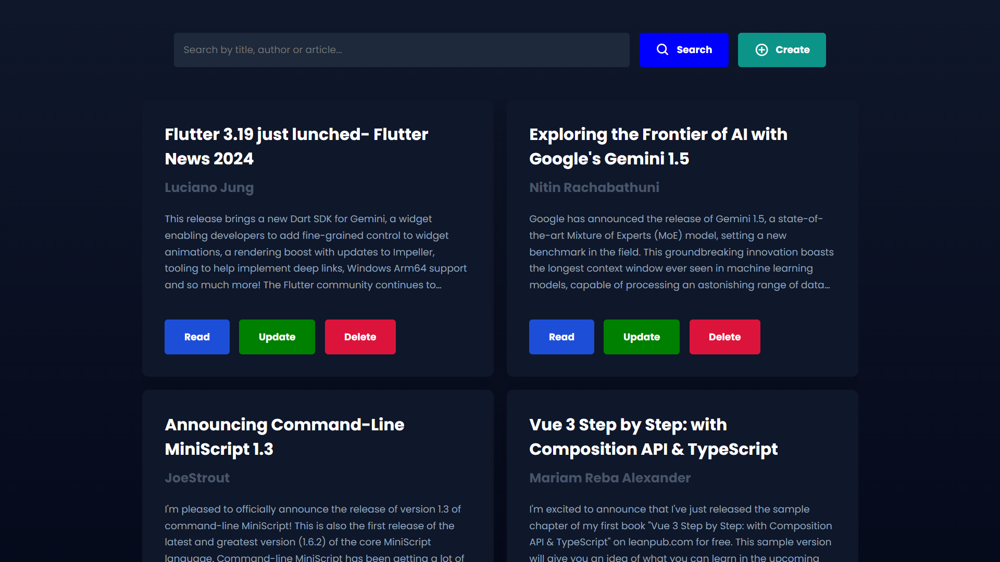

;

# Blog Website

Visually delighted blog application built with Node.js and MongoDB for database, thoughtfully crafted to embody the principles of contemporary design. Its sleek aesthetics and interactive elements transform your design blog into a visually stunning experience, engaging your audience in the artistry of your creations.Its responsive design adapts seamlessly, allowing your audience to immerse themselves in your design world from desktops to mobile devices.

### Highlights

* Responsive Design
* Forms
* Full CRUD functionality
* Search filter
* CSS Grid
* Responsive navigation

### Sections

* Home
* Create
* Read
* Update

# Installation

> [!IMPORTANT]
> Make sure you've already installed [Node](https://nodejs.org/en) and [Git](https://git-scm.com/) on your machine earlier.

Head into your folder and clone the repo by typing these comands in your terminal to check out the project:

```bash
git clone https://github.com/artyom250/blog-app.git
cd blog-app
npm install
node index
```